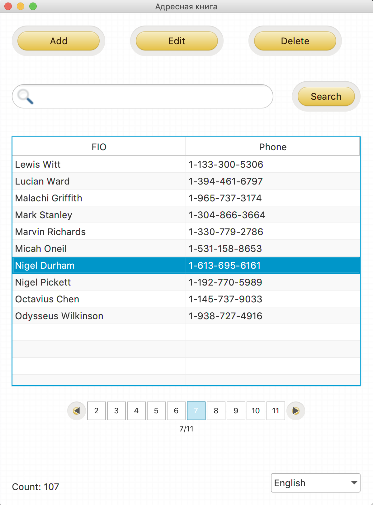
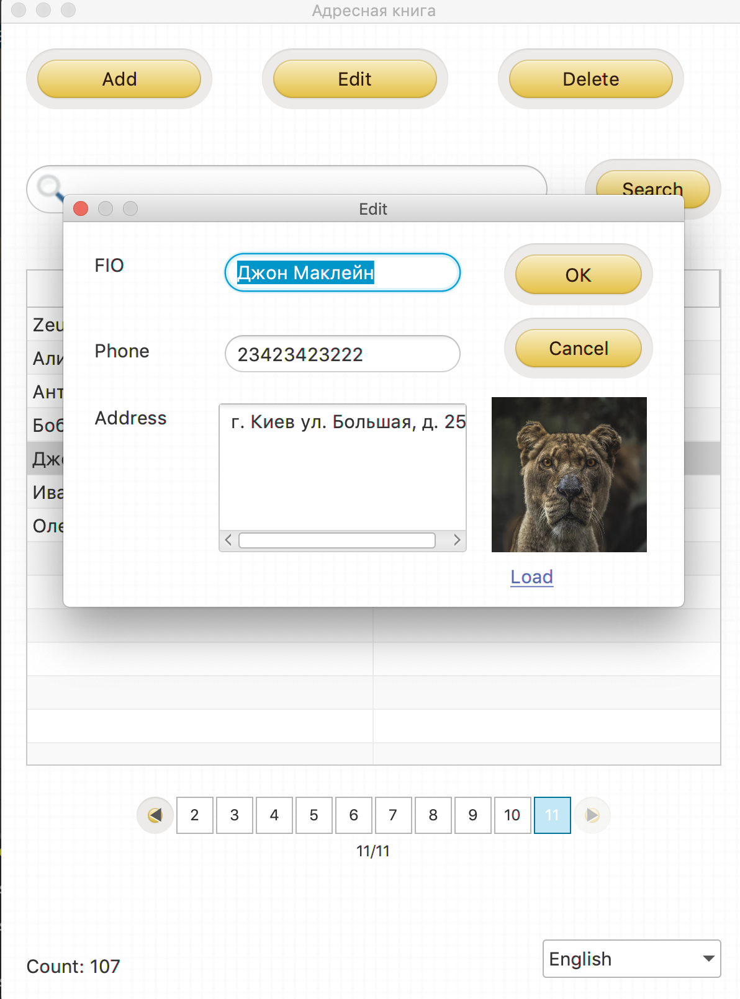

# Address book application!

### Introduction

Simple address book for storing names, phones, addresses and photos of people. 
You can add, edit, delete and search for contacts.

List of technologies: Spring Boot, Spring Core, Spring Data JPA, JPA/Hibernate,
JavaFX, SQLite, Gradle, Lombok,

## Screens

